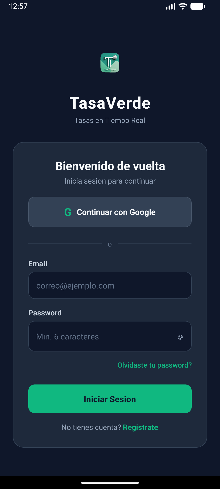
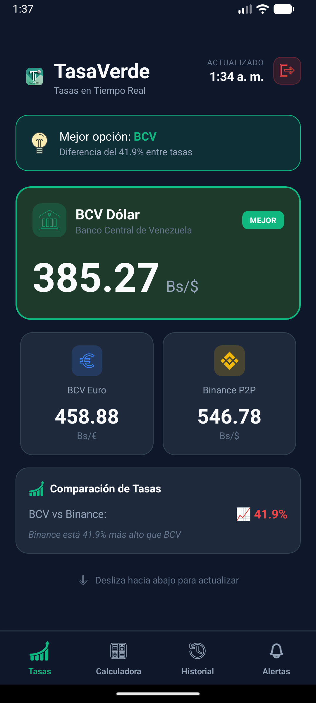
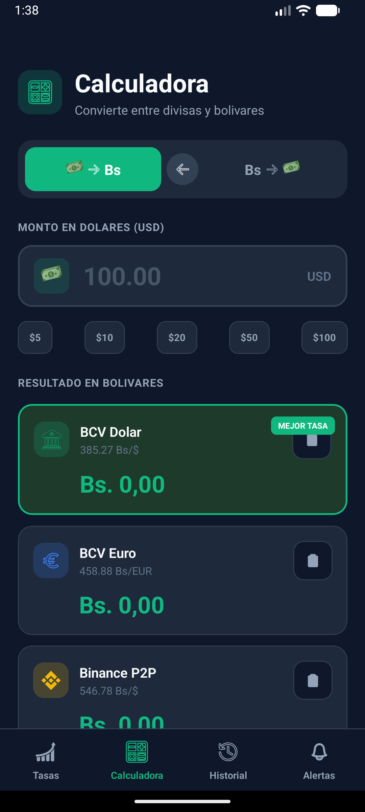
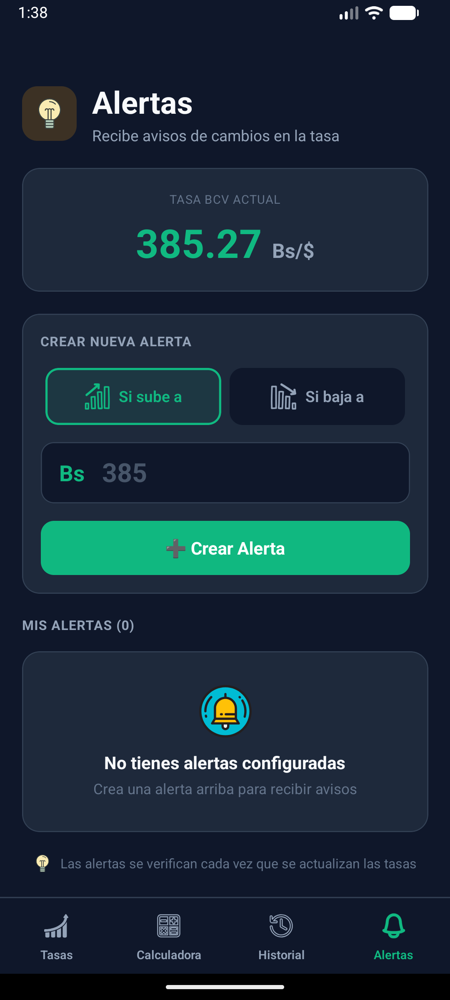

# TasaVerde

Real-time Venezuelan Bolivar exchange rate application. Compares BCV (Central Bank of Venezuela) with Binance P2P automatically.


---

## Table of Contents

- [About](#about)
- [Screenshots](#screenshots)
- [Features](#features)
- [Tech Stack](#tech-stack)
- [Architecture](#architecture)
- [Installation](#installation)
- [API Endpoints](#api-endpoints)
- [Deployment](#deployment)

---

## About

TasaVerde solves the daily problem Venezuelans face: finding the best exchange rate. Instead of checking multiple sources (BCV website, Binance, Instagram), users get everything in one app with automatic updates every 15 minutes.

### Key Highlights

- Real-time BCV and Binance P2P rates
- Automatic best option detection
- Built-in calculator with Pago Movil formatting
- Historical charts (7, 30, 90 days)
- Custom price alerts
- Authentication with Supabase (email/password + Google OAuth)
- Over-the-Air updates (no APK reinstall needed for most changes)

---

## Screenshots

### Login Screen



### Dashboard



### Calculator



### Historical Charts


### Price Alerts



---

## Features

### Authentication

- Email and password registration/login
- Google OAuth integration (expo-auth-session)
- Session persistence with AsyncStorage
- Secure logout with confirmation

### Dashboard

- BCV USD and EUR rates
- Binance P2P rate
- Best option indicator
- Percentage comparison
- Pull-to-refresh
- Last updated timestamp

### Calculator

- Bidirectional USD to Bs conversion
- Automatic thousands separator (3.500,00)
- Copy button for Pago Movil
- Haptic feedback

### Historical Charts

- SVG line charts
- Period selector (7, 30, 90 days)
- Min, max, average statistics
- Trend percentage

### Price Alerts

- Custom alerts: "If price goes above X" or "If price drops below X"
- Local persistence with AsyncStorage
- Automatic verification on rate updates

---

## Tech Stack

### Frontend (Mobile App)

| Technology       | Purpose                               |
| ---------------- | ------------------------------------- |
| Expo SDK 52      | Base framework                        |
| React Native     | Cross-platform UI                     |
| TypeScript       | Type safety                           |
| React Navigation | Tab navigation                        |
| TanStack Query   | Data fetching and caching             |
| Supabase         | Authentication (email + Google OAuth) |
| react-native-svg | Icons and charts                      |
| expo-haptics     | Tactile feedback                      |
| expo-clipboard   | Copy to clipboard                     |
| expo-updates     | Over-the-Air updates                  |
| AsyncStorage     | Local persistence                     |

### Backend (Server)

| Technology        | Purpose               |
| ----------------- | --------------------- |
| Node.js + Express | HTTP server           |
| TypeScript        | Type safety           |
| Cheerio           | BCV web scraping      |
| Axios             | HTTP requests         |
| CORS              | Cross-origin security |

### Authentication

| Service              | Purpose                               |
| -------------------- | ------------------------------------- |
| Supabase             | Auth backend (email/password + OAuth) |
| Google Cloud Console | OAuth 2.0 credentials                 |
| expo-auth-session    | OAuth flow handling                   |
| expo-web-browser     | Secure browser for OAuth              |

---

## Architecture

```
┌─────────────────────────────────────────────────────────────┐
│                     Mobile App (Expo)                       │
│  ┌──────────┐  ┌──────────┐  ┌──────────┐  ┌──────────┐    │
│  │  Auth    │  │Dashboard │  │Calculator│  │ History  │    │
│  └────┬─────┘  └────┬─────┘  └────┬─────┘  └────┬─────┘    │
└───────┼─────────────┼─────────────┼─────────────┼───────────┘
        │             │             │             │
        ├─────────────┴──────┬──────┴─────────────┘
        │                    │
   ┌────▼────┐         ┌─────▼──────┐
   │Supabase │         │  Backend   │
   │  Auth   │         │  (Express) │
   └─────────┘         └─────┬──────┘
                             │
                    ┌────────┴────────┐
                    │                 │
              ┌─────▼─────┐     ┌─────▼─────┐
              │ BCV Site  │     │ Binance   │
              │(Scraping) │     │ P2P API   │
              └───────────┘     └───────────┘
```

### Data Flow

1. **Authentication**: User logs in via Supabase (email/password or Google OAuth)
2. **Rate Fetching**: Backend scrapes BCV every 15 minutes, calls Binance API
3. **Caching**: Backend caches rates in memory for instant responses
4. **App Updates**: Mobile app fetches `/api/rates` and caches with TanStack Query
5. **Historical Data**: Backend stores daily snapshots in `history.json`

---

## Installation

### Prerequisites

- Node.js 18+
- npm or pnpm
- Expo Go app (on mobile device) or Android emulator

### Backend Setup

```bash
cd server
npm install

# Create .env file
echo "PORT=3000" > .env

# Start server
npm run dev
# Server running at http://localhost:3000
```

### Frontend Setup

```bash
npm install

# Create .env file with Supabase credentials
echo "EXPO_PUBLIC_SUPABASE_URL=your_supabase_url" > .env
echo "EXPO_PUBLIC_SUPABASE_ANON_KEY=your_anon_key" >> .env

# Start Expo
npx expo start
# Scan QR code with Expo Go
```

### Supabase Configuration

1. Create project at [supabase.com](https://supabase.com)
2. Get URL and anon key from Settings > API
3. Enable Email provider in Authentication > Providers
4. (Optional) Configure Google OAuth:
   - Create OAuth credentials in Google Cloud Console
   - Add redirect URI: `https://YOUR_PROJECT.supabase.co/auth/v1/callback`
   - Paste Client ID and Secret in Supabase Google provider

---

## API Endpoints

| Endpoint              | Method | Description                         |
| --------------------- | ------ | ----------------------------------- |
| `/api/rates`          | GET    | Current BCV and Binance rates       |
| `/api/history?days=7` | GET    | Historical data (7, 30, or 90 days) |
| `/api/trend?days=7`   | GET    | Trend percentage only               |

### Example Response: `/api/rates`

```json
{
  "bcv": {
    "usd": 37.25,
    "eur": 44.48,
    "date": "2024-02-09"
  },
  "binance": 49.12,
  "bestOption": "bcv",
  "lastUpdated": "2024-02-09T20:00:00Z"
}
```

---

## Deployment

### Backend (Render / Railway / Fly.io)

1. Connect GitHub repository
2. Set environment variables:
   - `PORT=3000`
3. Deploy with `npm run dev`

### Mobile App (EAS Build)

#### Generate APK

```bash
npx eas-cli build -p android --profile preview
```

Build takes ~10-15 minutes. Download APK from the provided link.

#### Over-the-Air Updates

For JavaScript/styling changes (no new native dependencies):

```bash
eas update --branch preview --message "Description of changes"
```

Users get the update automatically on next app launch.

---

## Project Structure

```
TasaVerde/
├── App.tsx                     # Entry point with navigation
├── app.json                    # Expo configuration
├── eas.json                    # EAS Build configuration
├── package.json                # Dependencies
│
├── src/                        # Frontend source code
│   ├── screens/
│   │   ├── AuthScreen.tsx          # Login/Register
│   │   ├── DashboardScreen.tsx     # Current rates
│   │   ├── CalculatorScreen.tsx    # USD/Bs converter
│   │   ├── HistoryScreen.tsx       # Historical charts
│   │   └── AlertsScreen.tsx        # Price alerts
│   │
│   ├── components/
│   │   ├── Icon.tsx                # SVG icon system
│   │   ├── SplashScreen.tsx        # Loading screen
│   │   ├── AnimatedComponents.tsx  # Animations
│   │   └── SkeletonLoader.tsx      # Loading skeletons
│   │
│   ├── hooks/
│   │   ├── useAuth.ts              # Authentication hook
│   │   ├── useRates.ts             # Rates fetching hook
│   │   └── useHistory.ts           # Historical data hook
│   │
│   └── services/
│       ├── supabase.ts             # Supabase client + auth
│       └── api.ts                  # HTTP client
│
├── server/                     # Backend Node.js
│   ├── src/
│   │   ├── index.ts                # Express server
│   │   └── services/
│   │       ├── bcv.ts              # BCV scraper
│   │       ├── binance.ts          # Binance P2P API
│   │       └── history.ts          # Historical data manager
│   │
│   └── data/
│       └── history.json            # Stored historical rates
│
├── assets/                     # Static resources
│   ├── icon.png                    # App icon
│   ├── adaptive-icon.png           # Android adaptive icon
│   ├── splash-icon.png             # Splash screen
│   └── icons/                      # Custom SVG icons
│
└── docs/
    └── screenshots/                # App screenshots
```

---

## License

Private project for personal and family use.

---

**Developed with Expo and React Native**
